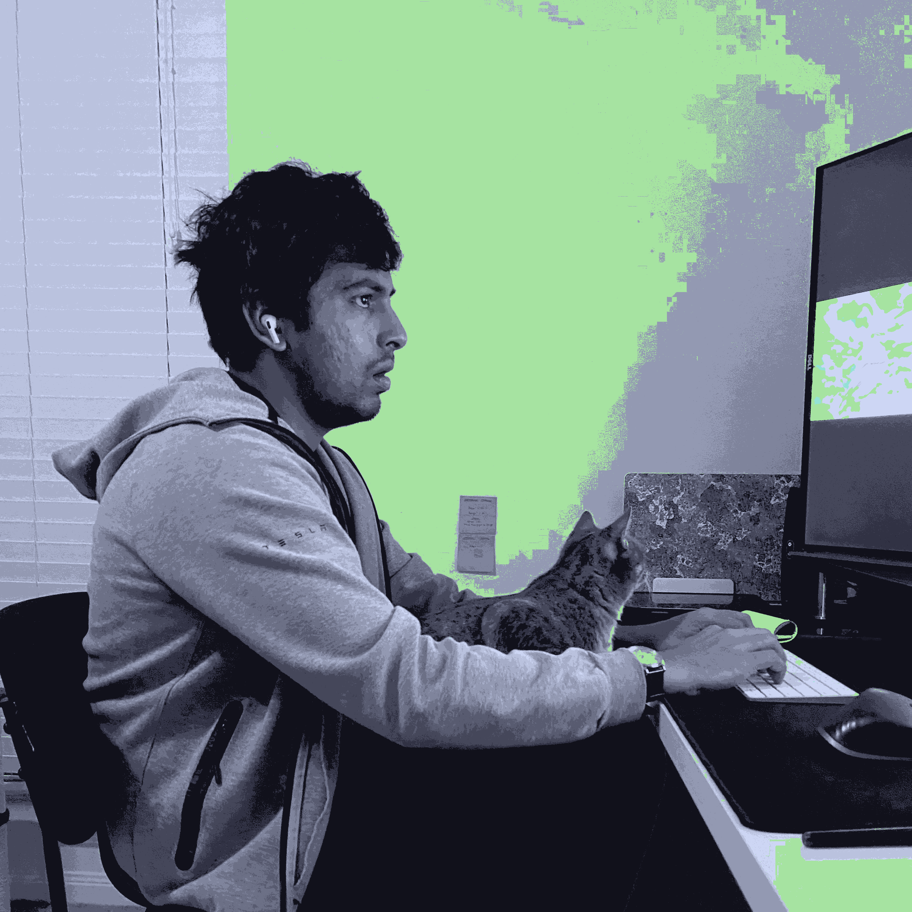

```bash
> neofetch
```
<div>

 

```csharp
shivajreddy@github
-------------------------
OS: MacOS
Shell: zsh 5.8
Location: Richmond, VA
Frameworks: Spring, FastAPI, React, SwiftUI
Languages: Java, Python, JS, TS, Swift
Learning: Swift, Rust
Theme: Catppuccin
Font: Berkeley Mono
Hobbies: BoardGames, Movies, Gaming, Editing-Dot-Files
Commits: 968
Stars: 14
```
<p align="left">
  &nbsp; &nbsp; &nbsp; &nbsp; &nbsp;
  &nbsp; &nbsp; &nbsp; &nbsp; &nbsp;
  
</p>
</div>
<br/>


## Hello there, I'm Shiva! 👋🏽 

* 🔨 Building [Nexus](https://github.com/shivajreddy/Nexus), the central system for General Contractors, to expedite home building.

* 📖 Education/Learning: 1 Year Full Stack bootcamp @ [Springboard](https://www.springboard.com/courses/software-engineering-career-track/), 1 Year learning core DSA @ [Coachable](https://www.coachable.dev/program), Spent 5000+ hrs. (while maintaining a full time job) on programming and counting.

* 🧑🏻‍💻 Software is my passion ❤️ (is an understatement)

* 💻 Languages I am/want to learn [Rust](https://www.rust-lang.org/), [C++](https://en.cppreference.com/w/Main_Page)

