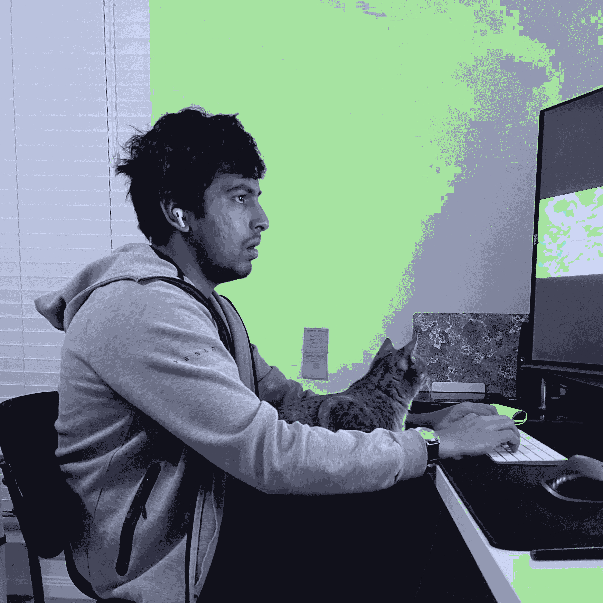

```bash
$ neofetch
```
<div>

 

```zsh
shivajreddy@github
-------------------------
OS: NIXOS
Shell: zsh 5.8
Location: Richmond, VA
Frameworks: Spring, FastAPI, React, Express, SwiftUI
Languages: Rust, Python, Java, TS
Learning: Rust 🦀
Theme: Catppuccin, Rosé Pine 
Font: Iosevka, Berkeley Mono
Hobbies: Chess, Poker, BoardGames, Movies, Reading
Commits: 968
Stars: 14
```
</div>
<br/>


## Hello there, I'm Shiva! 👋🏽 

* 🧑🏻‍💻 Software Engineering is my passion ❤️

* 🔨 Building [Nexus](https://github.com/shivajreddy/Nexus), the central system for General Contractors, to expedite home building

* 📖 Education: 1 Year Full Stack bootcamp @ [Springboard](https://www.springboard.com/courses/software-engineering-career-track/)

* 📖 Competitive Programming enthusiast

* 💻 Languages I want to improve - [Rust](https://www.rust-lang.org/)

* 🛠️ Toolkit: 
<a href="https://neovim.io/" target="_blank">neovim</a>, 
<a href="https://alacritty.org/" target="_blank">alacritty</a>, 
<a href="https://obsidian.md/" target="_blank">obsidian</a>, 
<a href="https://open.spotify.com/user/w05jst42jkzj3ju6ynrvv3ged" target="_blank">spotify</a>, 
